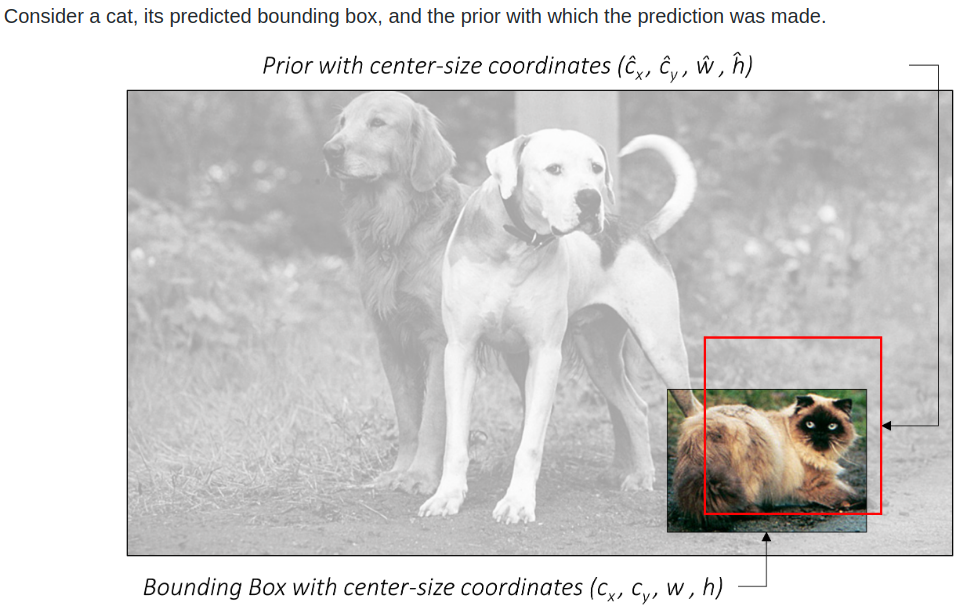

- # README

  When people first started with Object Detection Task(R-CNN series), the idea was to complete the task in two stages:

  * propose interesting regions to perform detection
  * and actually detect within the proposed regions

  While the accuracy of these algorithms are generally pretty awesome, the drawback of these approaches being that the 2-step-strategy is computationally very expensive for real-time applications.

  Single-Shot Detection(SSD) along with YOLO(v3) are two algorithms that excel with decent accuracy and extremely fast speed. 

  Acknowledgement: This is another project heavily guided by [sgrvinod’s](https://github.com/sgrvinod) tutorials. A big shout out for sgrvinod and his fantastic guides for learning various deep learning techniques. This project also depends on a number of really insightful academic papers such as: [SSD: Single Shot MultiBox Detector](https://arxiv.org/pdf/1512.02325.pdf), [Scalable Object Detection using Deep Neural Networks](https://arxiv.org/pdf/1512.02325.pdf),[ScratchDet](https://arxiv.org/abs/1810.08425),[learning rate annealing](https://arxiv.org/pdf/1608.03983.pdf) and [Non-Maximum suppression](https://arxiv.org/pdf/1705.02950.pdf) just to name a few.

  ## Project Overview

  There are 4 phases in this project each carries a purpose of implementing different deep learning techniques and experiment with its performance.

  *   Phase I: Vannila SSD300. An exact replica of the [original paper](https://arxiv.org/pdf/1512.02325.pdf).
  *   Phase II: We implement better [initialization techniques](https://arxiv.org/pdf/1502.01852.pdf) and implement [learning rate annealing](https://arxiv.org/pdf/1608.03983.pdf)
  *   Phase III: Applying batchnorm to just base/auxiliary/both and comparing transfer learning and training-from-scratch from the [ScratchDet paper](https://arxiv.org/abs/1810.08425)
  *   Phase IV: Learning an optimal weighting from this paper: [Geometric loss functions for camera pose regression with deep learning](https://zpascal.net/cvpr2017/Kendall_Geometric_Loss_Functions_CVPR_2017_paper.pdf)
  
  The **Vanilla model** is a exact replica of the model used in the original paper. We have a mAP of **74.6** which is quite a bit lower than the state-of-the-art result of the paper’s result(**77.2**, which we will be using for benchmarking). This is understandable since Wei, et al. must have tried different hyper-parameter combinations and presented the best performing one. 
  
  Don’t worry. In the next phase, we will be implementing `Kaiming_norm` initialization to layers that we are not transfer learning and also apply `learning rate annealing`. This two technique will give us a slight edge over the original design and bring us to an mAP of **77.3**.
  
  Of course, we don’t stop here. Phase III is all about **Batch-normalization**. We will be experimenting how batch-norm effect the loss during training and, naturally, the final accuracy. `nn.Batchnorm2d` will be injected in the `VGGbase` layers and `Auxiliary` layers for comparison. The resulting mAPs are **78.8** and **79.1**, respectively.
  
  The motivation for the final attempt was that there is parameter $\alpha$ which indicates the ratio between our two losses for the back-prop. In the [original paper](https://arxiv.org/pdf/1512.02325.pdf) $\alpha$ was directly set to `1`. This is not very convincing since $\alpha$ was not mathematically derived and there might exist another values for $\alpha$ that give us better training results. For this attempt, we will be implementing the technique of **learning the optimal weighting** for tasks with multiple losses from [this paper](https://zpascal.net/cvpr2017/Kendall_Geometric_Loss_Functions_CVPR_2017_paper.pdf). Unfortunately, this method gives around **77.6** mAP even after numerous fine-tuning. Thus, it seems that this strategy applies well on their problem but not quite on ours.
  
  ## Technical details used in this REPO
  
  
  
  ### Batchnorm implementation
  
  The original SSD architecture is Batchnorm-free. The inspiration is from this paper:[ScratchDet: Training Single-Shot Object Detectors from Scratch](https://arxiv.org/pdf/1810.08425.pdf). Objection detection’s current state-of-the-art detectors are generally fine-tuned from high accuracy classification networks. *e.g.*, VGGNet(which we will be using), ResNet and GoogLeNet **pre-trained** on ImageNet. There  both are advantages and disadvantages to use pre-trained base net. One of the primary reason not to train from scratch is that the optimization landscape is bumpy and not idea for training. Fortunately, now we have Batchnorm that could greatly mitigate this issue. This idea is introduced in [this paper](https://arxiv.org/pdf/1810.08425.pdf), and in this project’s Phase-III we shall utilize the idea of batchnorm to further improve our training result.
  
  Batch Normalization (BatchNorm) is a widely adopted technique that enables faster and more stable training of deep neural networks (DNNs). Despite its pervasiveness, the exact reasons for BatchNorm's effectiveness are still poorly understood. The popular belief is that this effectiveness stems from controlling the change of the layers' input distributions during training to reduce the so-called "internal covariate shift".(which was found out untrue in this paper: [How Does Batch Normalization Help Optimization?](https://arxiv.org/abs/1805.11604)) However, what it actually does, from a certain perspective, is to make the loss surface much more smoother so that our optimizer will have an easier time locating the global minimum.
  
  
  
  This paper has also shown that, “add batchnorm layers to every CNN layer” is more beneficial to if we train-from-scratch as compared to using a pre-trained model. The below table shows the performance of different result under various training conditions:
  
  
  
  
  
  ### Learning optimal learning rate
  
  SSD has two loss functions that we want to minimize: confidence loss & location loss (details included in later section).
  
  As we are training the network jointly with the two loss, a natural question to ask is that what’s the optimal ratio of these two losses to back-propagate so that we have the best training efficiency. In the [original SSD paper](https://arxiv.org/pdf/1512.02325.pdf), this question is not answered by simply assigned `ratio = 1` to the two losses and it seemed to work just fine.
  
  In the phase IV of this repo, we will be experimenting setting this ratio as two learnable parameters(one for each loss) following the guide in [this paper](https://zpascal.net/cvpr2017/Kendall_Geometric_Loss_Functions_CVPR_2017_paper.pdf).:
  $$
  L_\alpha(I) = L_c(I)\exp({-\hat{s_c}})+\hat{s_c}+L_l(I)\exp({-\hat{s_l}})+\hat{s_l}
  $$
  
  ### The SSD architecture
  
  Single-Shot Detection has three main components:
  
  * **Base convolutions** derived from popular image classification architectures that provides the *lower-level features* that we need. Usually a **VGG-16** net is used here(not ResNet50 for faster computation)
  * **Auxiliary convolutions** added on top of the base network that will provide higher-level feature maps
  * **Prediction convolutions** that will locate and identify objects in these features maps
  
  sgrvinod provides excellent explanations of the basic features of SSD in [his repo](https://github.com/sgrvinod/a-PyTorch-Tutorial-to-Object-Detection). Do go and check it out!  Here are the main gits:
  
  * The task of detection is quite similar to classification tasks in that we need to figure out what object is in each sub-region. Object detection task, of course, focus more on the local detection.
  * Similar to how Jeremy Howard introduced in his FastAI series, we leverage **Transfer Learning** to obtain good results in shorter amount  of time. (We will be using the pre-trained model that is directly available in Torch Vision)
  * Below is out base-architecture, VGG-16 in its vanilla form:
  
  
  
  * Things that sgrvinod has modified:
    	1. input image size: `300 by 300`
     2. *3rd pooling layer* and *5th pooling layer* to adjust the size of our feature map
     3. remove `fc6` and `fc7` with `conv6` and `conv7`. `fc8` is discarded.
  * The output shape of `conv5_3` is `7,7,512`. `fc6` has number of input equivalent to the flattened shape of `conv5_3` :$7*7*512 = 4096$. Therefore, we construct `conv6` to be `4096,7,7,512`.  We can see `conv6` as having `4096` filters, each with dimension `7,7,512`.
  * `conv7`is constructed as having `1,1` kernel size and `4096`output channels. Hence, `4096,1,1,4096`. We can see `conv7` as having `4096` filters, each with dimensions `1,1,4096`
  * To further reduce computation, we decrease size of each filter by sub-sampling parameters from the converted convolutional layers. Output dimension changes from `7,7,512` to `3,3,512`. `conv6` use `1024` filters instead of `4096` thus, `conv6`:`1024,3,3,512`.
  * `conv7` use `1024` filters from `conv6`, each with dimensions `1,1,1024`.
  
  #### Priors in SSD
  
  Priors are *precalculated*, *fixed* boxes which collectively represent this universe of probable and approximate box predictions.
  
  Priors are usually manually but carefully chosen based on the shapes and sizes of ground truth objects in our dataset. By placing these priors at every possible location in a feature map, we also account for variety in position.
  
  
  
  * Priors are applied to various **low-level** and **high-level** feature maps.  e.g., `conv4_3`, `conv7`, `conv8_2`, `conv9_2`, `conv10_2`, and `conv11_2`. Having size varying from `38*38` to `1*1`.
  * If a prior has a scale of `s`, then its area is equal to that of a square with side `s`. The largest feature map, `conv4_3`, will ahve priors with a scale of `0.1`, i.e, `10%` of image’s dimensions.`conv7` to `conv11_2` have scales from `0.2` to `0.9`. As we can see, **larger feature maps have priors with smaller scales and are therefore ideal for detecting smaller objects,** and vice versa.
  * At each position on a feature map, there will be priors of various aspect ratios. All feature maps will have priors with ratios `1:1, 2:1, 1:2`. The intermediate feature maps of `conv7`, `conv8_2`, and `conv9_2` will also have priors with ratios `3:1, 1:3`. Moreover, all feature maps will have *one extra prior* with a n aspecti ratios of `1:1` and at a scale that is the geometric mean of the scales of the current and subsequent feature map.
  * We define the priors in terms of their *scales (s)* and *aspect ratios (a)*:
  
  $$
  w*h = s^2\\
  \frac{w}{h} = a
  $$
  
  * The priors does not represent our final predicted boxes cause that might be inaccurate. Rather, *priors* represent approximately, the possibilities for prediction. This means: **We use each prior as an approximate starting point and then find out how much it needs to be adjusted to obtain a more exact prediction for a bounding box**
  * Hence, if each predicted bounding box is a slight deviation from a prior, and our gold is to calculate this deviation, we need a way to measure and quantify it.
  
  #### Calculating regression loss for bounding boxes
  
  Consider bounding boxes defined as — centre of x, centre of y, width, height: $(C_x,C_y,w,h)$.
  
   
  
  We have:
  $$
  g_{c_x} = \frac{c_x-\hat{c}_x}{\hat{w}} \\
  g_{c_y} = \frac{c_y-\hat{c}_y}{\hat{h}} \\
  g_w = log(\frac{w}{\hat{w}}) \\
  g_h = log(\frac{h}{\hat{h}})
  $$
  $(g_{c_x}, g_{c_y}, g_w, g_h)$ now represents our loss for which we will regress bounding boxes’ coordinates on.
  
  #### Predictions
  
  We have defined priors for six feature maps of vairous scales and granularity. From `conv4_3`, `conv7`, `conv8_2`, `conv9_2`, `conv10_2` ,and `conv11_2`.
  
  Then, **for each prior at each location on each feature map** we want to predict:
  
  1. the offsets $(g_{c_x}, g_{c_y}, g_w, g_h)$ for the bounding box
  2. a set of `n_classes` scores for the bounding box, where `n_classes` represents the total number of object types(including a background class)
  
  To do this in the simplest manner, **we construct two convolutional layers for each feature map**
  
  * a **localisation prediction** convolutional layer with a `3, 3` kernel evaluating at each location (i.e. with padding and stride of `1`) with `4` filters for *each prior* present at the location
  
    The `4` filters for a prior calculate the four encoded offsets $(g_{c_x}, g_{c_y}, g_w, g_h)$  for the bounding box
  
  * a **class prediction** convolutional layer with a `3,3` kernel evaluating at each location (i.e. with padding and stride of `1`) with `n_classes` filters for each prior present at the location
  
    The `n_classes` filters for a prior calculate a set of `n_classes` scores for that prior.
  
  #### Calculating Multibox loss
  
  Object detection task has a special loss calculation  case as it’s calculating the loss of a classification task and regression task all together.
  
  Therefore, our total loss would be an **aggregation of losses from both types of predictions** — bounding box localization and class scores.
  
  ##### Matching predictions to ground truth
  
  For any supervised learning algorithm, we need to be able to match predictions to their ground truths. This is tricky in *Object Detection* since **we don’t have the output—ground truth paring before hand**
  
  For the model to learn anything, we’d have to construct the problem in a way that our *predictions* are **pared** with the *objects* in the image. Priors will enable us to do just that:
  
  * **Find the Jaccard overlap**($\frac{overlap}{union}$) between the 8732 priors and `N` ground truth objects. This will be a tensor of size `8732, N`.
  * **Match** each of the 8732 priors to the object with which it has the **greatest overlap**
  * if a prior is matched with an object with a **Jaccard overlap of less than 0.5**, then it cannot be said to “contain” the object, and is therefore a **negative match**. Consifering we have thousands of priors, most priors will test negative for an object.
  * On the other hand, a handful of priors will actually have **Jaccard overlap greater than `0.5`**. These are our **positive matches**.
  * Now that we have **matched each of the 8732 priors to a ground truth**, we have, in effect, also matched  the corresponding 8732 predictions to a ground truth.
  * All predictions have a ground truth label, which is either the type of object if it is a positive match or a *background* class if it is a negative match. These are used as **targets for classification task**
  
  #### Localization loss
  
  we have **no ground truth coordinates for the negative matches**. This makes perfect sense. Why train the model to draw boxes around empty space?
  
  Therefore, the **localization** loss is computed **only on how accurately we regress positively matched predicted boxes** to the corresponding ground truth corrdinates.
  
  Since we predicted localization boxes in the form of offsets $(g_{c_x}, g_{c_y}, g_w, g_h)$ , we would also need to encode the ground truth coordinates accordingly before we calculate the loss.
  
  The localization loss is the average **Smooth L1 loss** between the *encoded offsets of positively matched localization boxes* and their *ground truth*.
  $$
  L_{loc} = \frac{1}{n_{positives}}(\sum_{positives}Smooth L_1 Loss)
  $$
  
  #### Confidence loss
  
  Every prediction, no matter positive or negative, has a ground truth label associated with it. It is important that the model recognises both objects and a lack of them(background).
  
  However, considering that there are usually only a handful of objects in an image, **the vast majority of the thousands of predicitons we made** do not contain an object. If have a huge number of negative matches, we would end up with a model that learnt to detect the background class and they has 0 loss contribution.
  
  The solution is to use those predictions where the model found it hardest to recognize that there are no objects. This is called **Hard Negative Mining**.
  
  The number of hard negatives we will use, `N_hn`, is usually a fixed multiple of the number of positive matches for this image. For example, we define the `N_hn` as three times as big as **the number of actual object in this image**. `N_hn = 3*N_p`.
  
  Then how do we find the “hardest negatives”??
  
  We would compute the **cross entropy loss** for each negatively matched prediction and choose with top `N-hn` losses. Hence, we have our function for **confidence loss**:
  $$
  L_{conf}=\frac{1}{n_{positives}}(\sum_{positives}CE\ loss+\sum_{hard\ negatives}CE\ loss)
  $$
  Notice that we only average over **number of positives**, hence the *hard negative losses* acts as a additional loss.
  
  #### Total loss
  
  Now that we have two losses: $L_{loc}$ and $L_{conf}$, we just need to aggregate them with a combined ratio $\alpha$:
  $$
  L = L_{conf}+\alpha\cdot L_{loc}
  $$
   The good thing is, we don’t even have to decide the value for $\alpha$ as it could be a learnable parameter.
  
  #### Non-Maximum Suppression (NMS)
  
  After the model is trained, we can apply it to images. However, the predictions are still in their raw form—two tensors containing the offsets and class scores fore 8732 priors. These would need to be processed to **obtain final, human-interpretable bounding boxes with labels.** 
  
  * We have 8732 predicted boxes represented as offsets $(g_{c_x}, g_{c_y}, g_w, g_h)$  from their respective priors. Decode them to boundary coordinates, which are actually directly interpretable.
  
  * For each **non-background** class:
  
    	1. Extract the scores for this class for each of the 8732 boxes.
     2. Eliminate boxes that do not meet a certain threshold for this score.
     3. The remaining (uneliminated) boxes are candidates for this particular class of object
  
    At this point, if we were to draw these candidate boxes on the original image, we would see **many highly overlapping boxes that are obviously redundant**. This was because that we have a huge number of priors that might have a reasonable resemblance to the object’s bounding box. For instance:
  
  
  
  We can see that “dog B” and “doc C” are essentially the same dog, and so does “cat A” and “cat B”.
  
  
  
  #### Solution
  
  First, we sort them by their scores. (This is **NOT** the score of their objectness. Rather, the scores among of their own class. The reason is that we don’t a high score dog to suppress the cat when they happen to cuddle closely together.)
  
  The next step is to find which candidates are redundant. We would be using the same tool to make this judgement: the Jaccard overlap, namely IoU. The idea is to have a **threshold IoU**, and suppress the any bounding box above this pre-specified **IoU** among the same class prediction.
  
  
  
  Note that, this step is class specific. We are only eliminating bounding boxes when compared with their only class group. If we have 100 classes, we need to perform this process 100 times for each class we have.
  
  As we can see from this figure above, “Dog c” is eliminated because: it has a higher IoU (that we predefined) with “dog A” (that has a higher class score). “Cat B” is eliminated with the same reason: it has lower score than “Cat A” and has a high IoU of 0.8 with it.
  
  This is the process of Non-Maximum Suppression because when multiple candidates are found to overlap significantly with each other such that they could basically be referencing the same object, **we suppress the ones with lower scores.**
  
  Algorithmically, it is coded as follows:
  
  * for each selected candidate from each **non-background class**:
    * Arrange candidates for this class in order of descending scores
    * Consider the candidate with highest score. Eliminate all candidate in this class that has lower score but higher IoU than our predefined threshold (usually `0.5`).
    * Consider the next highest-scoring candidate still remaining in the pool. Repeat the same eliminating process
    * Run through the entire sorted candidates within this class and move on to the next
  
  #### weight initialization
  
  We will initialise the Auxiliary Convolution layers with `nn.init.kaiming_uniform_(c.weight, nonlinearity='relu')` just to compare with result with traditional `nn.init.xavier_uniform_`.
  
  The reason is explained is that we are using `relu` activation after these conv nets which `xavier_uniform_` does not take into consideration. A more specific explanation can be found with [Jeremy Howard’s tutorial with FastAI](https://forums.fast.ai/t/lesson-9-discussion-wiki-2019/41969)